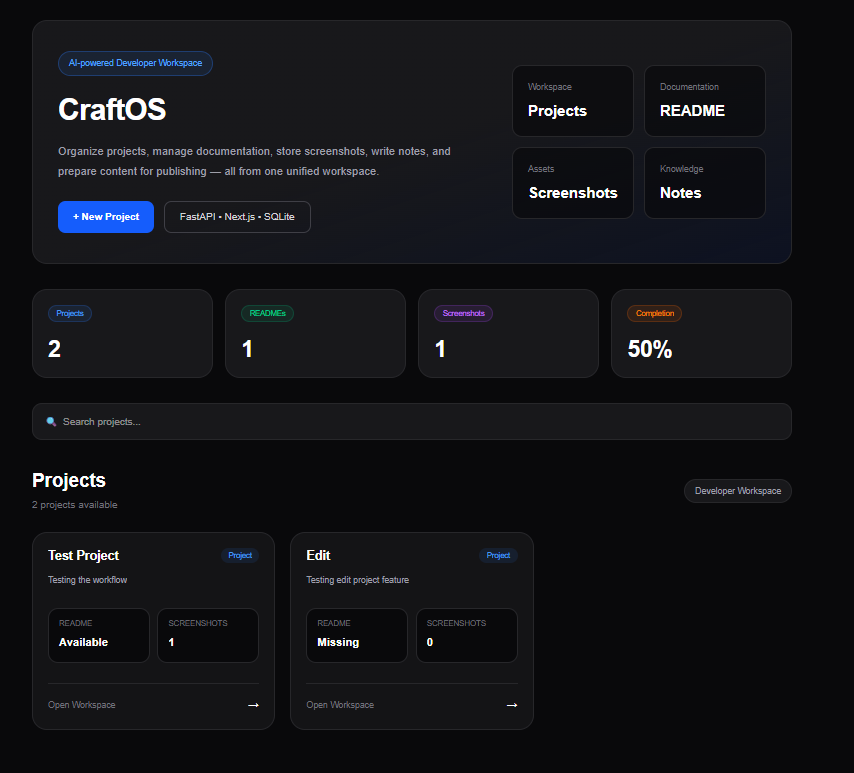
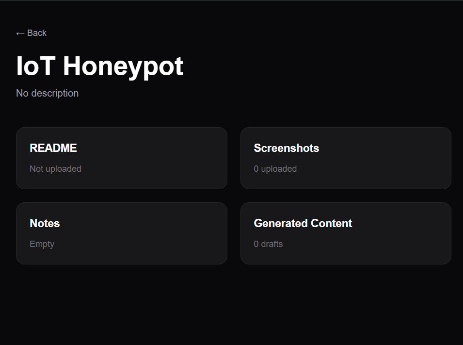
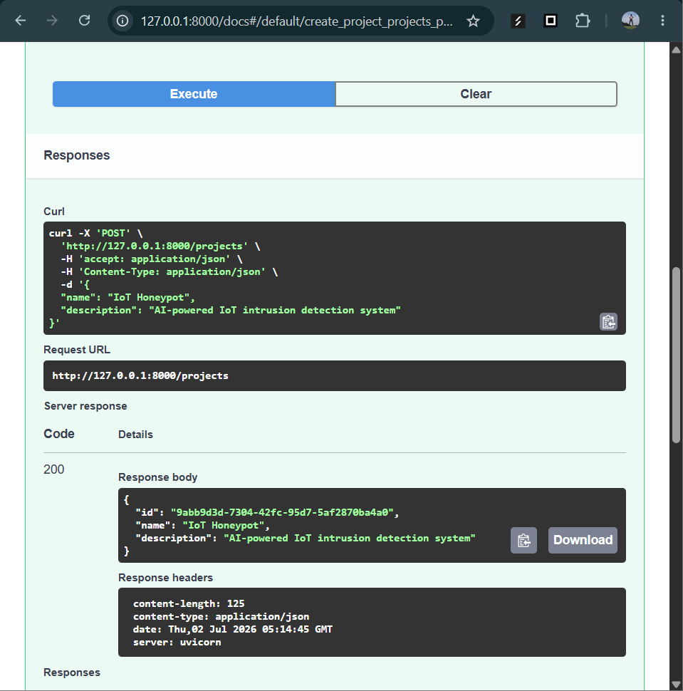
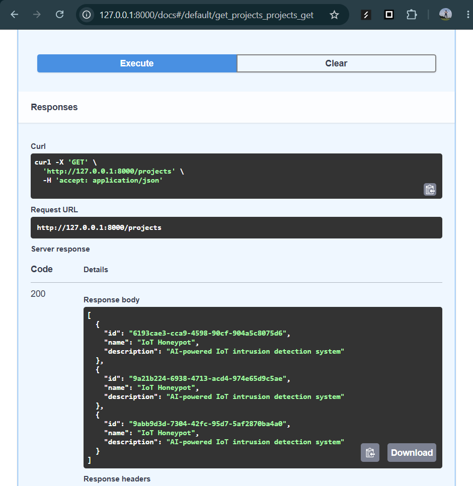
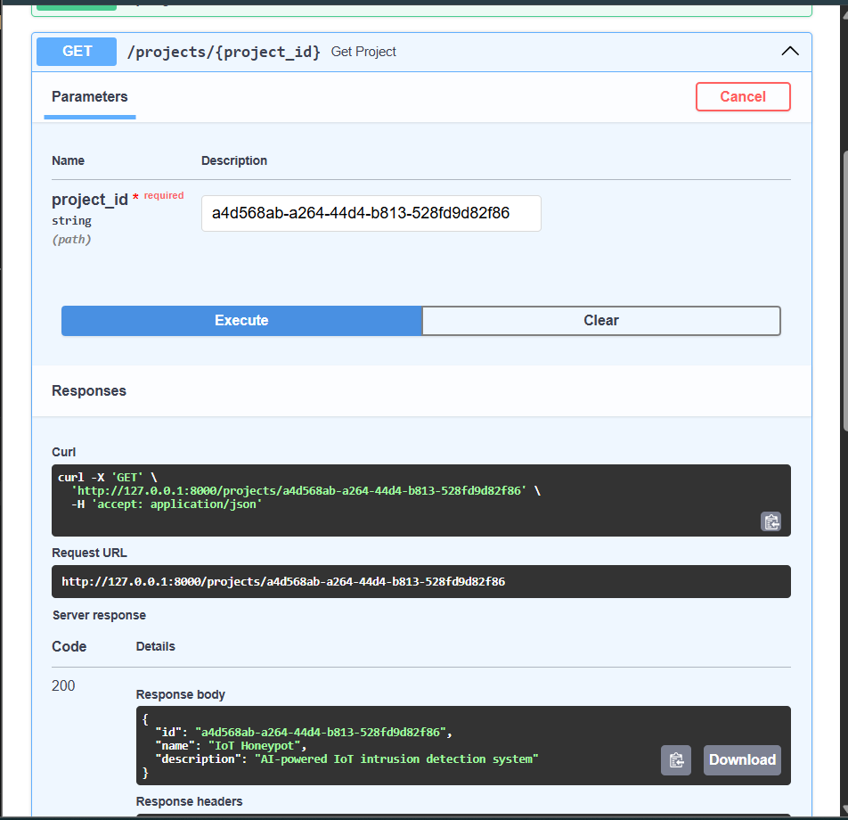
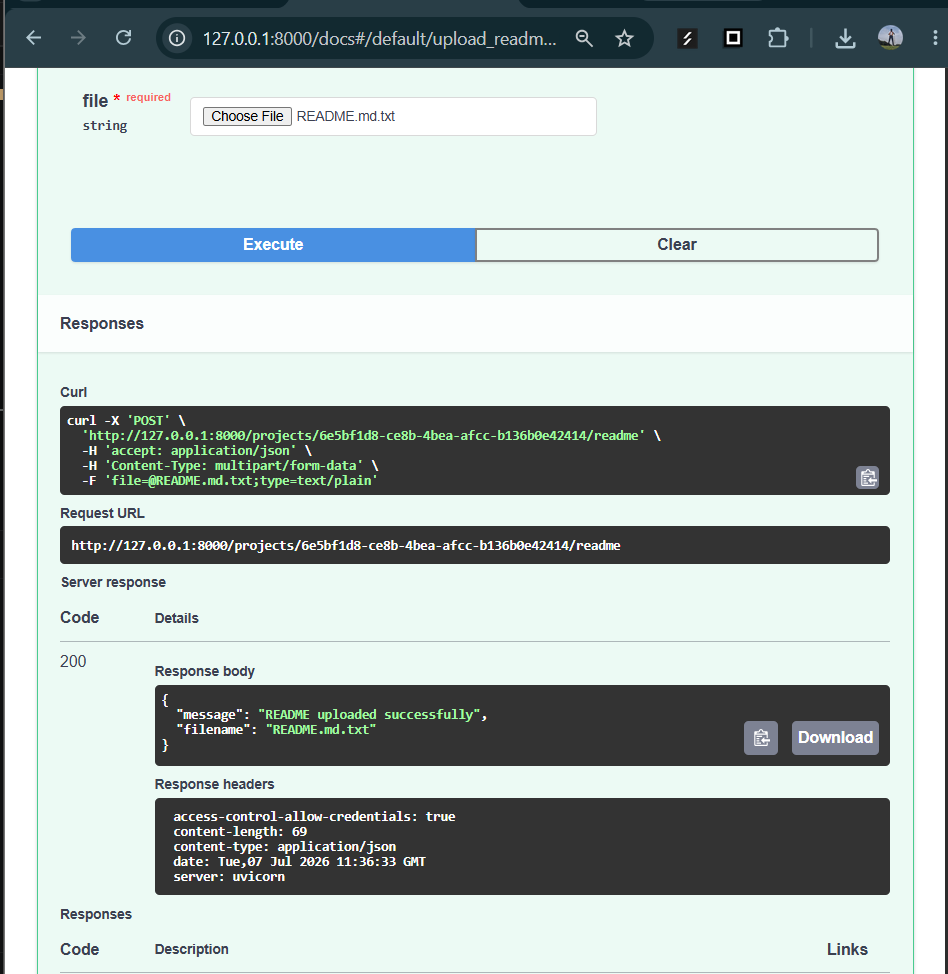
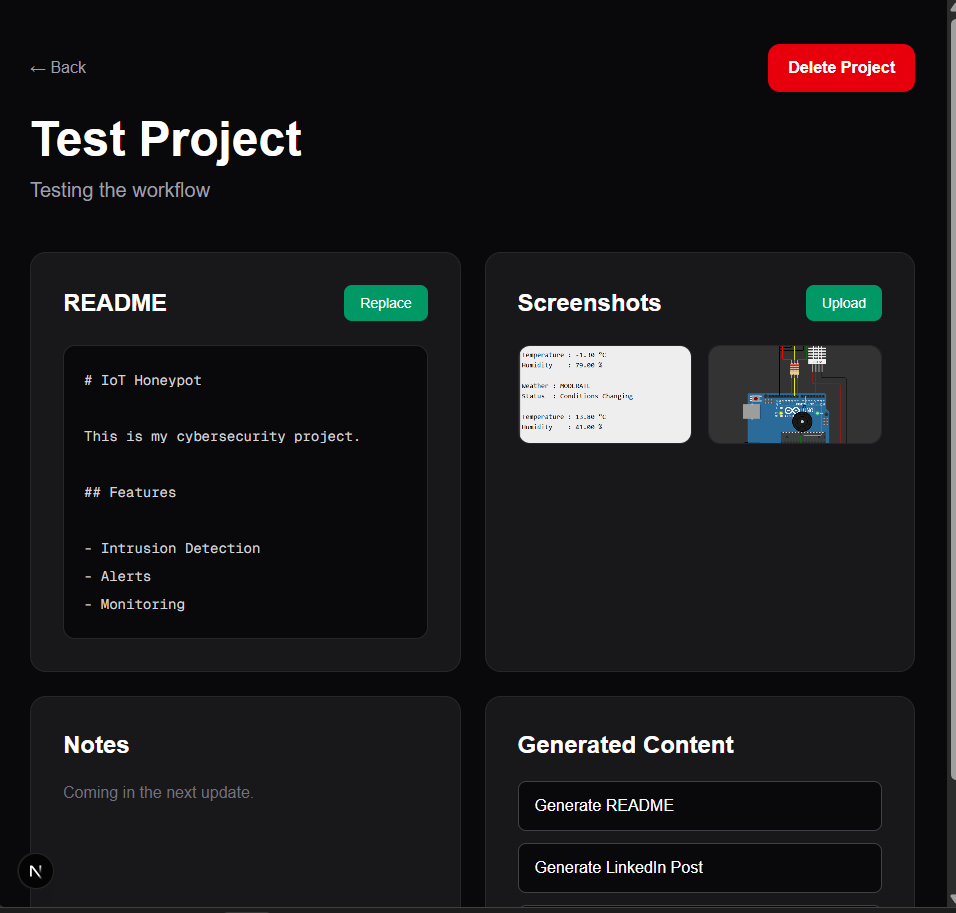
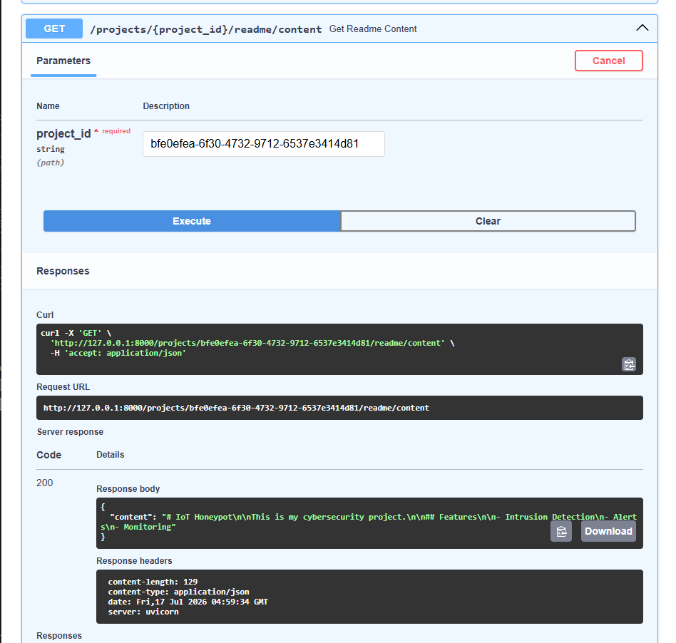
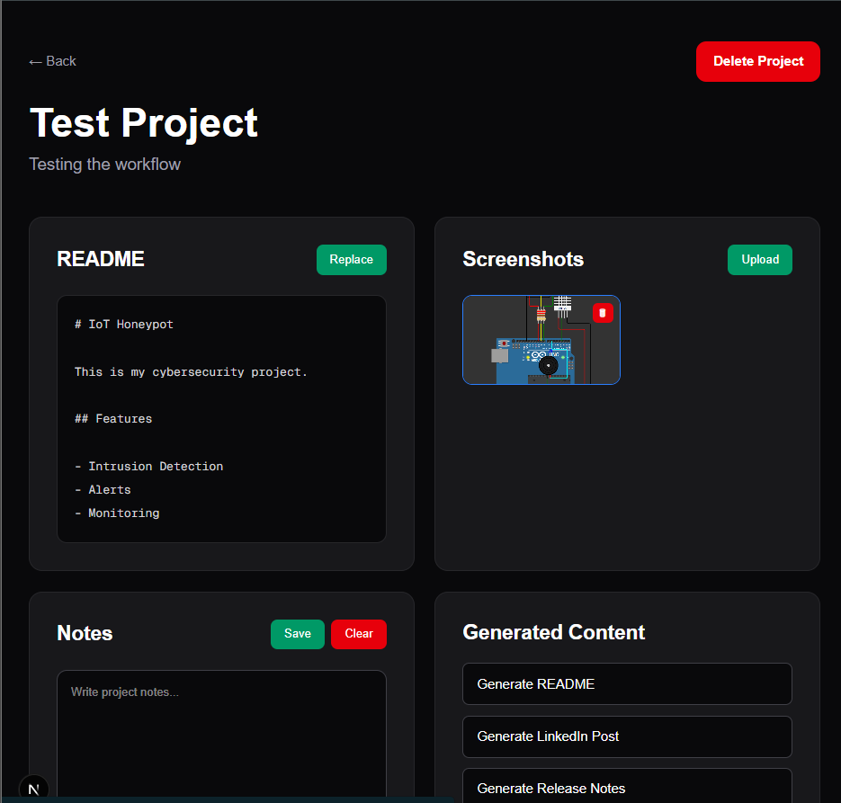

# CraftOS

AI-powered Content Operating System for developers, students, and creators.

CraftOS helps organize software projects by storing project details, README files, screenshots, notes, and AI-generated content in one workspace.

---

# Features

- Create, view and delete projects
- Persistent SQLite project storage
- Dedicated project workspace
- Upload and replace README files
- Embedded README viewer
- Upload multiple project screenshots
- Screenshot gallery with preview
- REST API built with FastAPI
- Interactive Swagger/OpenAPI documentation
- Next.js + React frontend

---

# Tech Stack

## Frontend

- Next.js
- React
- TypeScript
- Tailwind CSS

## Backend

- FastAPI
- Python
- SQLite
- Uvicorn

---

## Documentation

- [Architecture](docs/ARCHITECTURE.md)

---

# Project Structure

```
CraftOS
│
├── app/
│   ├── lib/
│   ├── project/
│   └── layout.tsx
│
├── backend/
│   ├── app/
│   │   ├── api/
│   │   ├── crud.py
│   │   ├── database.py
│   │   └── main.py
│   │
│   ├── uploads/
│   │   ├── readmes/
│   │   └── screenshots/
│   │
│   └── craftos.db
│
├── components/
│
├── docs/
│   └── screenshots/
│
└── README.md
```

---

# API Endpoints

| Method | Endpoint | Description |
|---------|----------|-------------|
| GET | / | API Status |
| GET | /projects | Get all projects |
| POST | /projects | Create project |
| GET | /projects/{project_id} | Get project |
| POST | /projects/{project_id}/readme | Upload README |
| GET | /projects/{project_id}/readme | Get README file |
| GET | /projects/{project_id}/readme/content | Get README content |
| POST | /projects/{project_id}/screenshots | Upload screenshot |
| GET | /projects/{project_id}/screenshots | List screenshots |
| GET | /screenshots/{filename} | View screenshot |
| DELETE | /projects/{project_id} | Delete project |

---

# Current Features

## Dashboard



---

## Project Workspace



---

## Create Project API



---

## Get Projects API



---

## Get Project by ID



---

## Upload README



---

## README Viewer



---

## README Content API



---

## Screenshot Gallery


---

## Delete Screenshot



---

# Running the Backend

```bash
cd backend

.\venv\Scripts\activate

uvicorn app.main:app --reload
```

Backend:

```
http://127.0.0.1:8000
```

Swagger:

```
http://127.0.0.1:8000/docs
```

---

# Running the Frontend

```bash
npm install

npm run dev
```

Frontend:

```
http://localhost:3000
```

---

# Roadmap

- ✅ Project Management
- ✅ README Management
- ✅ Screenshot Management
- ⏳ Notes
- ⏳ AI Content Generation
- ⏳ Project Export

---

# Author

Smruthi Nayak