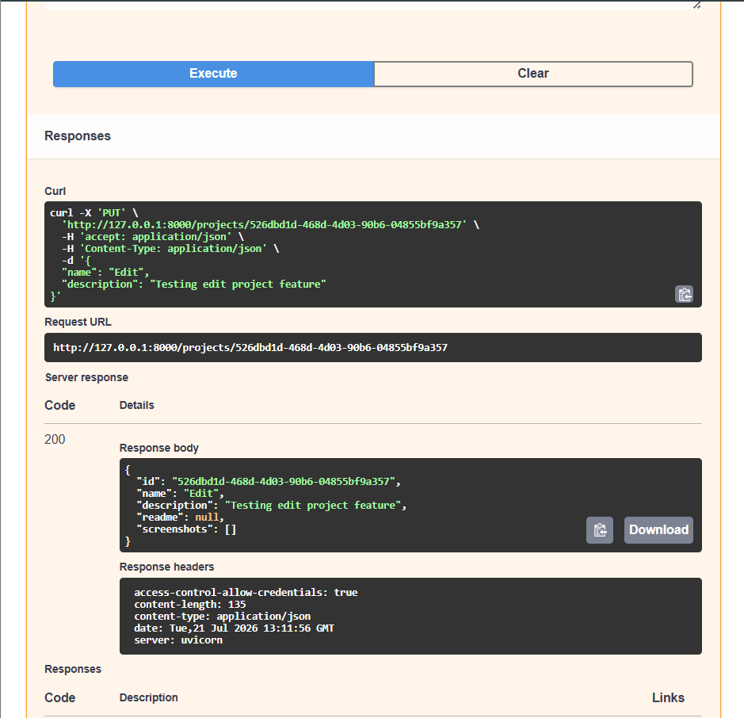

# CraftOS

An AI-powered Content Operating System for developers, students, and creators.

CraftOS is a centralized workspace for managing software projects. It combines project organization, documentation, screenshots, notes, and AI-assisted content generation into a single application, eliminating the need to manage project assets across multiple tools.

---

## Overview

Managing software projects often means switching between README files, screenshots, personal notes, documentation, and content drafts spread across different folders and applications.

CraftOS brings everything together in one workspace by allowing you to:

- Organize projects
- Manage documentation
- Store screenshots
- Write project notes
- Generate content (planned)
- Access everything through a clean web interface backed by a REST API

---

## Features

### Project Management

- Create projects
- View all projects
- Edit project details
- Delete projects
- Persistent SQLite storage

### README Management

- Upload README files
- Replace existing README
- Embedded README preview
- Retrieve raw Markdown through the API

### Screenshot Management

- Upload multiple screenshots
- Visual screenshot gallery
- Full-size preview
- Delete screenshots

### Notes

- Save project-specific notes
- Edit notes
- Clear notes

### Developer Experience

- FastAPI REST API
- Interactive Swagger documentation
- Next.js + React frontend
- SQLite database
- Modular backend architecture

---

## Tech Stack

### Frontend

- Next.js
- React
- TypeScript
- Tailwind CSS

### Backend

- FastAPI
- Python
- SQLite
- Uvicorn

---

## Architecture

Detailed project architecture is available here:

**docs/ARCHITECTURE.md**

---

# Screenshots

## Dashboard


---

## Project Workspace


---

## README Viewer


---

## API Documentation (Swagger)




---

## README API


---

## Screenshot Management


---

## REST API

| Method | Endpoint | Description |
|---------|----------|-------------|
| GET | `/` | API Status |
| GET | `/projects` | List projects |
| POST | `/projects` | Create project |
| GET | `/projects/{project_id}` | Get project |
| PUT | `/projects/{project_id}` | Update project |
| DELETE | `/projects/{project_id}` | Delete project |
| POST | `/projects/{project_id}/readme` | Upload README |
| GET | `/projects/{project_id}/readme` | Download README |
| GET | `/projects/{project_id}/readme/content` | Get README content |
| POST | `/projects/{project_id}/screenshots` | Upload screenshot |
| GET | `/projects/{project_id}/screenshots` | List screenshots |
| DELETE | `/screenshots/{filename}` | Delete screenshot |
| GET | `/screenshots/{filename}` | View screenshot |
| GET | `/projects/{project_id}/notes` | Get notes |
| POST | `/projects/{project_id}/notes` | Save notes |
| DELETE | `/projects/{project_id}/notes` | Delete notes |

---

## Project Structure

```text
CraftOS
│
├── app/
│   ├── lib/
│   ├── project/
│   └── layout.tsx
│
├── backend/
│   ├── app/
│   │   ├── api/
│   │   ├── crud.py
│   │   ├── database.py
│   │   └── main.py
│   │
│   ├── uploads/
│   │   ├── readmes/
│   │   └── screenshots/
│   │
│   └── craftos.db
│
├── components/
├── docs/
└── README.md
```

---

## Getting Started

### Backend

```bash
cd backend

.\venv\Scripts\activate

uvicorn app.main:app --reload
```

Backend

```
http://127.0.0.1:8000
```

Swagger

```
http://127.0.0.1:8000/docs
```

---

### Frontend

```bash
npm install

npm run dev
```

Frontend

```
http://localhost:3000
```

---

## Roadmap

### Completed

- ✅ Project Management
- ✅ README Management
- ✅ Screenshot Management
- ✅ Notes

### Planned

- AI README Generation
- LinkedIn Post Generation
- Release Notes Generation
- Project Export
- GitHub Integration
- Authentication
- Cloud Storage

---

## Author

**Smruthi Nayak**