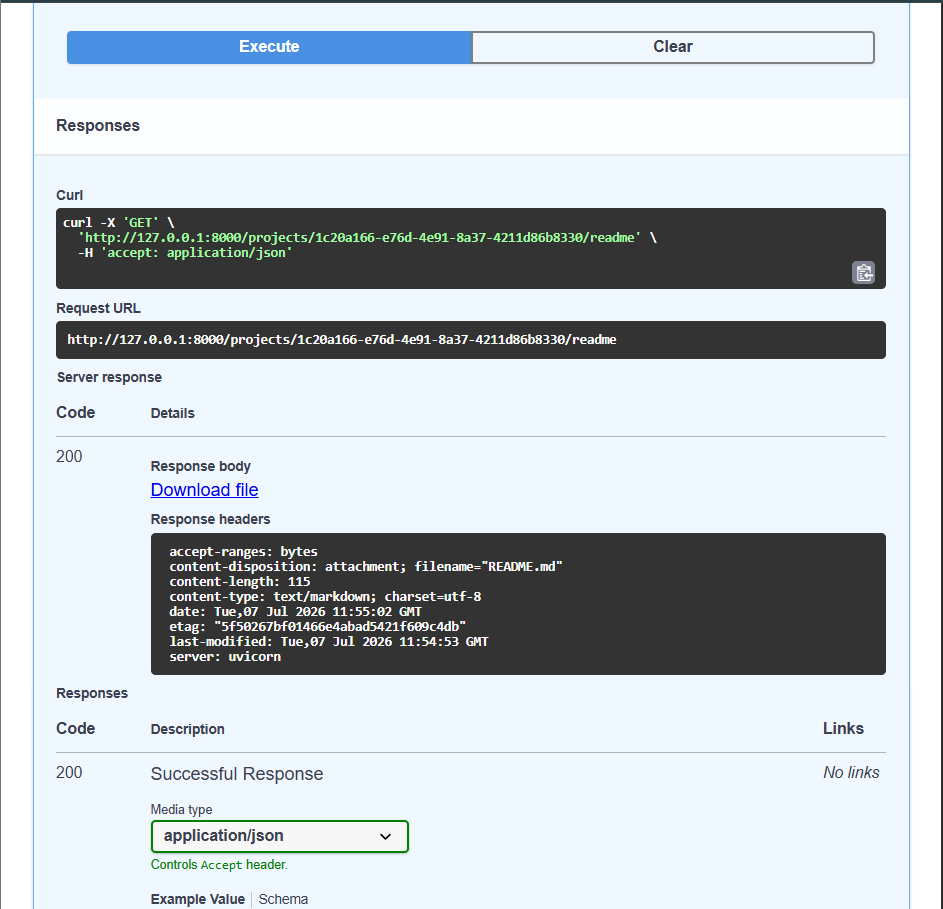
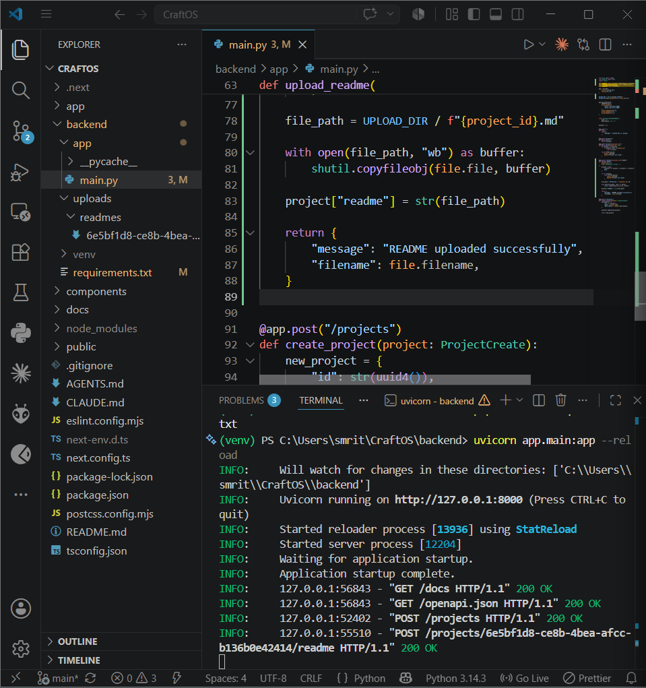

# CraftOS

AI-powered Content Operating System for developers, students, and creators.

CraftOS helps organize software projects by storing project details, README files, screenshots, notes, and AI-generated content in one workspace.

---

# Features

- Create projects
- View all projects
- View individual project workspace
- Upload README files
- Download README files
- REST API with FastAPI
- Next.js frontend
- Interactive Swagger documentation

---

# Tech Stack

## Frontend

- Next.js
- React
- TypeScript
- Tailwind CSS

## Backend

- FastAPI
- Python
- Uvicorn

---

# Project Structure

```
CraftOS
│
├── app/
│   ├── lib/
│   └── project/
│
├── backend/
│   ├── app/
│   │   └── main.py
│   │
│   └── uploads/
│       ├── readmes/
│       └── screenshots/
│
├── components/
│
├── docs/
│   └── screenshots/
│
└── README.md
```

---

# API Endpoints

| Method | Endpoint | Description |
|---------|----------|-------------|
| GET | / | API Status |
| GET | /projects | Get all projects |
| POST | /projects | Create project |
| GET | /projects/{project_id} | Get project |
| POST | /projects/{project_id}/readme | Upload README |
| GET | /projects/{project_id}/readme | Download README |

---

# Current Features

## Dashboard


---

## Project Workspace


---

## Create Project API


---

## Get Projects API


---

## Get Project by ID


---

## Upload README


---

## Download README



---

## README Storage



---

# Running the Backend

```bash
cd backend

.\venv\Scripts\activate

uvicorn app.main:app --reload
```

Backend:

```
http://127.0.0.1:8000
```

Swagger:

```
http://127.0.0.1:8000/docs
```

---

# Running the Frontend

```bash
npm install

npm run dev
```

Frontend:

```
http://localhost:3000
```

---

# Roadmap

- ✅ Project Management
- ✅ README Management
- ⏳ Screenshot Management
- ⏳ Notes
- ⏳ AI Content Generation
- ⏳ Project Export

---

# Author

Smruthi Nayak